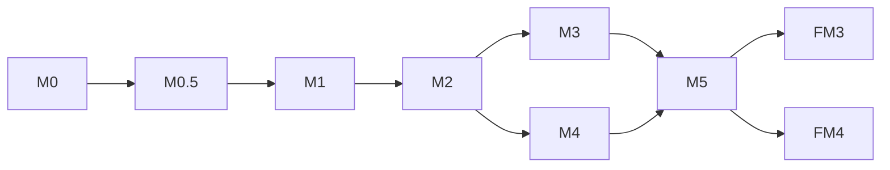

把第十章 + 第十一章 + 第十二章整个走完一遍。**这一轮的"账面指标"列得很整齐，但深挖下去 4 个评审目标都有坑**——主要集中在性能指标缺维度、OTel 集成范围没说清、黄金集 50 条没有可执行性、M 验收缺判定标准。

---

## 一、§10.1 性能指标可达成性 🟡 8 个问题

### ✅ 已有指标（12 个）

变更影响评估 / 三路IR合并 / 分治编辑端到端 / IR节点定位 / SSE 推送 / StaleMonitor / 校验链 / Vue3 编译 / 大屏编译 / AI 单次对话 / 沙箱创建 / DB 查询

### 🟡 严重问题

**P-1. "三路IR合并" 概念不清（性能指标语义模糊）**

§10.1.1 写"三路IR合并 < 500ms (1000节点)"——但**没说什么是"三路"**：
- 批次1 三 Agent 合并？→ 但议题 5 锁定的批次1是 3 Agent（FuncModule+BizProcess+Database），批次2是 3 Agent
- 议题 3 的 3 路合并？还是 §11.3.3 的"3 个 replace+1 个 add"组合操作？

**怎么改**：明确"三路 IR 合并"= 批次1 三个 SubAgent（FunctionalModuleAgent + BusinessProcessAgent + DatabaseAgent）的产出合并为 Stage2 IR 的耗时，跟议题 5 §图 7-2 锁定项对齐。

**P-2. 缺前端性能指标**

§8.4.7 列出 FCP < 2s / LCP < 2.5s / FID < 100ms / CLS < 0.1 / JS gzip < 500KB，但 **§10.1 没汇总**。前后端指标脱节。

**怎么改**：§10.1.1 加一节"前端性能指标"，把 §8.4.7 的指标搬过来 + 加验收方式（Lighthouse CI）。

**P-3. 缺并发/容量性能指标**

§10.1 只列了"沙箱 5 并发"，缺：
- 5 沙箱同时跑时 DB CPU/内存峰值
- 100 个流水线并发创建时表现
- 1000 个活跃流水线时 PipelineManager.vue 加载时间

**怎么改**：§10.1.3 新增"容量规划"小节，给出 3 个等级：
- 轻度（10 流水线 + 2 沙箱）：基线性能
- 中度（100 流水线 + 5 沙箱）：生产目标
- 重度（1000 流水线 + 10 沙箱）：扩展边界

**P-4. "DB 查询 P95 < 200ms" 太宽泛**

§10.1 写"DB 查询 P95 < 200ms"——但哪个查询？需要按**高频查询**给出指标：

| 查询                                      | 目标    |
| ----------------------------------------- | ------- |
| BASE_USER 登录查询                        | < 50ms  |
| BASE_AI_PIPELINE 单条查询                 | < 100ms |
| BASE_AI_PIPELINE_MESSAGE 历史查询（分页） | < 300ms |
| BASE_KNOWLEDGE_NODE BFS 邻居扩展          | < 200ms |
| BASE_IR_VERSION 版本对比                  | < 200ms |

**怎么改**：§10.1.4 新增"DB 查询 P95 指标分解"，按表×查询类型展开。

**P-5. 缺降级性能指标**

降级到 DeepSeek 时延迟增加多少？降级链触发时用户体验如何？

**怎么改**：补 §10.1.5"降级性能"：
- 主供应商 P95 < 60s
- 降级 1 P95 < 80s（容忍 +20s）
- 降级 2 P95 < 100s（容忍 +40s）
- 全部失败 → 自动切换到"无 AI 专家模式"（响应时间 = 0）

**P-6. 缺性能衰减曲线**

1 沙箱 / 2 沙箱 / 5 沙箱时各项指标如何衰减？数据库连接池会不会爆？

**怎么改**：§10.1.6 新增"性能衰减矩阵"，给出 1/2/5 沙箱并发下的指标衰减。

**P-7. ⚠️ 待实测的指标太多**

§10.1.1 状态列里 6 项标"⚠️ 待实测"：
- 分治编辑端到端
- IR节点定位
- SSE checkpoint 推送
- AI 单次对话 P95
- 沙箱创建/销毁
- DB 查询 P95

**全部 P0 验收项**——验收阶段怎么算"已实测"？需要：
- 在哪个里程碑实测？M2 还是 M5？
- 实测环境规格？单机/集群？
- 采样方法？100 次/1000 次？

**P-8. 缺性能测试工具链说明**

§10.1.1 验收方式只列了工具名（vitest / k6 / JMeter），没说：
- 性能基线（baseline）什么时候建？
- 性能回归 CI 怎么配？
- 性能告警阈值是多少？

**怎么改**：§10.1.7 新增"性能基线管理"：
- 基线建档：每次发版前跑 benchmark，结果存 `BENCHMARK_BASELINE` 表
- CI 回归：pr merge 前跑 benchmark，对比基线，>10% 衰减告警
- 性能 dashboard：MiniProfiler / OTel 导出到 Grafana

---

## 二、§10.3.3 OpenTelemetry 前置依赖 🔴 5 个严重问题

§10.3.3 内容只有 3 行：
```
- 风险 R10：判官 R_black 40% 无数据来源
- 阶段五启动前 OTel 必须就绪
- 熔炉 F1 前 OTel 必须完成集成
```

### 🔴 严重问题

**O-1. OTel 集成范围不清**

哪些组件需要 OTel？
- 后端 .NET 8 服务？✅ 显然
- 前端 Vue3？浏览器 → OTel Collector？
- 熔炉 Python？独立仓库的
- 沙箱 Docker 容器？容器内应用需要 OTel 吗？

**怎么改**：§10.3.3 改成：

| 组件           | 是否集成 OTel | 集成方式                                       |
| -------------- | ------------- | ---------------------------------------------- |
| 后端 .NET 服务 | ✅             | OpenTelemetry .NET SDK + OTLP exporter         |
| 前端 Vue3      | ⚠️ 仅核心页面  | OpenTelemetry JS + Browser exporter            |
| 熔炉 Python    | ✅             | OpenTelemetry Python + OTLP exporter           |
| 沙箱 Docker    | ❌             | 沙箱内部应用不集成（由沙箱本身的可观测性负责） |

**O-2. OTel Collector 部署架构没说**

- 单实例还是 HA？
- 存储后端用什么？Jaeger / Tempo / Zipkin / SigNoz？
- 采样率多少？
- 数据保留期多久？

**怎么改**：补 §10.3.4 OTel 部署架构图 + 配置规格：

```yaml
# otel-collector-config.yaml（示例）
receivers:
  otlp:
    protocols:
      grpc: { endpoint: 0.0.0.0:4317 }
      http: { endpoint: 0.0.0.0:4318 }

processors:
  batch: { timeout: 5s }
  probabilistic_sampler: { sampling_percentage: 10 }  # 10% 采样

exporters:
  otlp/jaeger:
    endpoint: jaeger:4317
    tls: { insecure: true }

service:
  pipelines:
    traces: { receivers: [otlp], processors: [probabilistic_sampler, batch], exporters: [otlp/jaeger] }
```

**O-3. 缺追踪 ID 传递机制**

跨服务追踪的 traceparent / tracestate 头怎么传？
- 后端 → LLM 调用？要不要透传到 MiMo/DeepSeek？
- 前端 → 后端？X-Trace-Id 头？
- Hangfire 后台任务？任务入队时怎么带上 traceparent？

**怎么改**：§10.3.5 补"追踪上下文传递规范"：
- 所有 HTTP 调用自动注入 `traceparent` 头（W3C Trace Context 标准）
- Hangfire 任务入队时把 traceparent 存到 Job.Parameters，启动时恢复
- LLM 网关在 BASE_AI_CALL_LOG.F_TRACE_ID 字段记录

**O-4. 缺性能开销预算**

OTel 自身会带来 5-15% 性能开销。**§10.1 的业务性能指标需不需要重测？**

**怎么改**：§10.3.6 加一句："OTel 集成后，业务性能指标允许 5% 衰减（详见 §10.1.8）"

**O-5. 缺 R10 详细说明**

§10.3.3 提"风险 R10：判官 R_black 40% 无数据来源"——**R10 是什么？R_black 是什么？40% 是什么意思？没上下文**。

**怎么改**：要么删掉这个引用（避免误读），要么补一节"§12.7 R10 详细说明"解释清楚。

**O-6. 缺"就绪"判定标准**

"OTel 必须就绪"——什么叫"就绪"？是 SDK 引入就算，还是有完整 trace 才算？

**怎么改**：§10.3.3 改成：
- M0 前：OTel SDK 引入 + OTLP exporter 配置 + 一个示例 trace
- M1 前：跨服务 trace 完整（含 Hangfire + SignalR）
- M2 前：生产环境 OTel Collector 部署 + Grafana dashboard
- M3 前：跨租户 trace 隔离

---

## 三、§11.3 AI 评测基准 50 条黄金集 🟡 9 个问题

### ✅ 已有结构

- 5 领域 × 10 条 = 50 条
- 难度分布 1-3/4-7/8-10 各 4/4/2
- §11.3.5 评测运行器（eval-runner.ts + EvalService）

### 🟡 严重问题

**E-1. EVAL_GOLDEN_SET 表缺 9 个字段**

对照议题 1-5 锁定项 + 多租户要求，缺：

| 缺失字段           | 用途                                                    |
| ------------------ | ------------------------------------------------------- |
| F_TENANT_ID        | 多租户隔离（评测基准可能是租户级）                      |
| F_CREATED_BY       | 哪个创始人/专家创建                                     |
| F_TAGS             | 标签（如：是否涉及工作流 / 大屏 / 移动端 / 校验链失败） |
| F_REQUIREMENT_TYPE | CRUD / 流程 / 大屏 / 移动端                             |
| F_EXPECTED_SCHEMA  | 数据库 Schema 期望（DDL/JSON）                          |
| F_EXPECTED_API     | API 期望（OpenAPI/YAML）                                |
| F_BASELINE_MODEL   | 基线模型（如 mimo-v2.5-pro）                            |
| F_BASELINE_SCORE   | 基线分数（如 0.85）                                     |
| F_VERSION          | 黄金集版本（演进管理）                                  |

**E-2. 50 条黄金集的具体需求没列**

§11.3.2 只列了领域分布，**没列具体 50 条需求是什么**。比如：
- 教育-001：学生成绩管理系统（已示例）
- 教育-002 到教育-010：**空白**
- 医疗-001 到医疗-010：**空白**
- ...

**怎么改**：补 §11.3.2.1 "50 条黄金集完整列表"，每条需求至少给：标题、领域、需求描述（1-2 句）、难度、关键 IR 节点数。

**E-3. 缺黄金集构建流程**

§12.3 标"阶段五硬门禁 - 评测基准 50 条黄金集 | 第 25 天"，但**没说怎么构建**：
- 谁负责：创始人？测试工程师？AI 工程师？
- 构建流程：需求收集 → 评审 → IR 设计 → Review → 入库
- 多久 Review 一次？月度？季度？
- 黄金集演进时怎么处理历史数据？

**怎么改**：补 §11.3.6"黄金集构建 SOP"：
1. 创始人+AI 工程师每月构建 5-10 条新需求
2. 每个需求由 2 个 SubAgent 独立生成 IR，取共识
3. AI 工程师 review + 标注 expectedIR
4. 创始人最终审批入库
5. 黄金集版本化（F_VERSION）

**E-4. 缺评测维度细分**

§11.2.2 给出 3 个评分维度：
- 需求分析师准确率 ≥ 80%
- 架构师输出可编译率 ≥ 90%
- 数据库设计规范合规率 = 100%

**缺**：
- UI 设计合理性评分（视觉一致性、组件复用率）
- API 设计一致性评分（命名规范、错误码统一）
- 工作流设计可行性评分（节点可达性、闭环检测）
- 评测时使用的 Prompt 版本
- 评测时使用的模型版本

**怎么改**：§11.2.2 扩展到 6-8 个维度 + 加 Prompt/Model 版本字段。

**E-5. 缺评分算法**

§11.3.5 写"每条黄金集产出 IR 与 expectedIR 比较"——**怎么比较**？
- 简单字段相等？
- 结构化对比（忽略无关字段）？
- LLM-as-Judge？
- 容忍度阈值多少？

**怎么改**：§11.3.7 补"评分算法"：
- IR Schema 层：JSON Schema 校验（必过）
- 业务语义层：关键节点匹配（>= 80% 通过）
- 视觉/交互层：LLM-as-Judge + 人工抽检
- 总分：加权平均（Schema 30% + 业务 50% + 体验 20%）

**E-6. 缺黄金集版本管理**

**怎么改**：F_VERSION + F_BASELINE_SCORE 双字段 + §11.3.8"基线管理"。

**E-7. 缺评测运行器细节**

§11.3.5 提了 eval-runner.ts + EvalService，但没说：
- 什么时候跑？手动 / CI / 定时？
- CI 集成是阻塞还是可选？§11.2.2 写"可选 job（不阻塞主流程）"——为什么可选？评测不阻塞 PR merge 怎么防回退？
- 评测结果如何展示？EvalReport.vue？

**怎么改**：§11.3.9 评测执行规范：
- PR merge 前必跑（阻塞）
- 每天定时跑全量（日报）
- 每周生成趋势报告（周报）
- 评测结果展示页面：EvalReport.vue

**E-8. 缺评测通过/失败的处理流程**

某条黄金集评测失败时：
- 立即告警？
- 自动回滚？
- 还是人工 review？

**怎么改**：§11.3.10 补"评测失败处理"：
- 单条失败：记录到 `EVAL_RUN_LOG`，不阻塞 PR
- 同一条连续 3 次失败：自动 GitHub Issue + 通知 AI 工程师
- 整体通过率 < 80%：自动回滚到上一个通过的版本（需配置）

**E-9. §12.3 标"评测基准 50 条黄金集"是 A6 缺口**

但 §12.3 同时写"M0.5 评测基准 | 阶段五启动前 | ⚠️ 待建"——**矛盾**：
- M0.5 是阶段五启动前的门禁
- 但 §12.3 阶段五硬门禁说"第 25 天"——这是阶段五的第 25 天还是启动前？

**怎么改**：明确"阶段五启动前"= M0.5 完成，"第 25 天"= 阶段五第 25 天更新一次。两条路径不要混。

---

## 四、M0~M5 里程碑验收条件 🔴 6 个严重问题

### 🔴 严重问题

**M-1. 验收条目只有 Git Tag，没有具体标准**

§12.1 列了：
- v5.2-ai-infrastructure-m0
- v5.2-studio-m1-alpha
- v5.2-studio-m1
- ...

**这是 Git Tag 名，不是验收条件**。每个里程碑必须给出**可测量的验收标准**：

| 里程碑        | 当前描述                        | 建议补充                                                     |
| ------------- | ------------------------------- | ------------------------------------------------------------ |
| M0 基座       | IR + 网关 + 10 地桩 + Gate 全绿 | **必须通过 150+ 单测 + 5 集成测试 + vue-tsc 0 错误 + 后端 0 build error** |
| M1 流水线化   | 阶段 1/2 Agent + SSE            | **必须支持 100 流水线并发 + 阶段 1 准确率 ≥ 80% + SSE 推送延迟 < 200ms** |
| M2 全流程     | 阶段 3-5 + FlowIR + 多角色      | **必须支持 5 并发沙箱 + 沙箱创建 ≤ 30s + 5 角色菜单完整可用** |
| M3 多租户     | MultiTenancy=true + 越权测试    | **必须 10 条越权用例全绿 + ITenantFilter 全链路验证 + 100% 业务表含 F_TENANT_ID** |
| M4 创始人链路 | 守护 + 知识补丁                 | **必须 TOTP 通过 + 知识补丁签名验证 1 次联调通过 + 创始人控制台 UI 可用** |
| M5 发布候选   | Gate + 集成 + Demo              | **必须 50 条黄金集通过率 ≥ 80% + 100% 端到端流程贯通 + 现场 Demo 通过** |

**M-2. M0~M2 都标"✅ 已完成"过于乐观**

§12.1 标 M0/M1/M2/M3/M4 都是"✅ 已完成"，但：
- §1.3.2 B 段很多项是"⚠️ 前端已实现 / 后端待实现"
- §3.2.5b 视图注册表与 6 SubAgent 不匹配（议题 2 B-07 阻塞）
- §5 接口契约严重缺失（议题 4 B-04/B-05/B-06 阻塞）

**怎么改**：每个里程碑加"实际完成度盘点"列，区分"✅ 真完成 / ⚠️ 部分完成 / ❌ 待补"。

**M-3. 缺跨里程碑依赖关系图**

§12.5 全平台统一验收表只是文字，**没有 Mermaid 甘特图或依赖矩阵**。建议补 §12.9"跨里程碑依赖图"：



**M-4. 阶段五硬门禁（§12.3）18 项混乱**

§12.3 列出 18 项，但**"已达成"和"待完成"标记混乱**：
- "大模型网关 6 供应商 ✅ 第 5 天达成"——但议题 1 B-01 锁定的是 5 级配置+2 级熔断触发
- "五阶段流水线编排 ✅ 2026-06-20 裁决书接口全部实现"——但议题 4 B-04/B-05/B-06 还缺接口契约
- "组件注册表 ≥ 90% ✅ 92.6%"——这个数字哪里来的？

**怎么改**：每项门禁补：
- 验收标准（可测量）
- 验收方式（自动化 / 人工）
- 验收时间点（哪个里程碑）

**M-5. 缺延期/回退机制**

- 哪些里程碑可以延后？
- 哪些门禁是不可妥协的？
- 哪个里程碑延期会影响下游？

**怎么改**：§12.10 补"延期决策矩阵"：
- P0 不可延期：M0/M0.5/M5
- P1 可延期 1 周：M1/M3
- P2 可延期 2 周：M2/M4
- 延期 1 周影响：M2 延期 1 周 → M3/M4 同步延期 → M5 延期

**M-6. M5 发布候选的"Gate + 集成 + Demo" 太模糊**

- Gate 具体是什么？CI Gate（PR 不能 merge）还是文档 Gate？
- 集成测试多少条？覆盖率？
- Demo 是什么形式？现场演示？录屏？

**怎么改**：§12.1 M5 行改成具体：
- **CI Gate**：所有单测+集成测试+E2E 测试必须 100% 通过
- **集成测试**：11 个场景（§11.2.1）+ 50 条黄金集（§11.3）
- **Demo**：3 个真实场景（OA 进销存 / 教育选课 / 医疗挂号）从需求到部署全流程现场演示

---

## 五、跨议题一致性确认

| 已锁定来源                       | §10/§11/§12 现状                            | 一致？ |
| -------------------------------- | ------------------------------------------- | ------ |
| 议题 1 §4.0 全局熔断（3 次失败） | §10.4.1 写"P95 > 60s 持续 3 次"             | ✅      |
| 议题 1 I-01 abandoned 终止态     | §11.3.4 状态机测试用例 10                   | ✅      |
| 议题 2 B-08 输入输出契约         | §11.3.4 没列出 6 Agent 的契约测试           | ❌      |
| 议题 3 BASE_IR_VERSION           | §11.3.3 没列出 IR 版本对比测试              | ❌      |
| 议题 4 §5 接口全集               | §11.2.1 集成测试只列 10 条，没覆盖 18+ 端点 | ❌      |
| 议题 5 I-14 双视图               | §11.3.4 状态机没列双视图门禁测试            | ❌      |
| §9.3.2 越权 10 条                | §11.2.1 第 5 项引用                         | ✅      |
| §9.5 创始人越权边界              | §11.3.4 状态机没列 L3 不可越权测试          | ❌      |

**8 项里 4 项不一致**——第十一、十二章对前 5 议题的锁定项覆盖不足。

---

## 六、严重程度汇总

| 类别           | 🔴 阻塞 | 🟡 警告 | 💡 建议 |
| -------------- | ------ | ------ | ------ |
| §10.1 性能指标 | 1      | 7      | 0      |
| §10.3.3 OTel   | 5      | 1      | 0      |
| §11.3 黄金集   | 2      | 7      | 0      |
| §12.1 M0~M5    | 6      | 0      | 0      |
| **合计**       | **14** | **15** | **0**  |

---

## 七、给 D 爷的处置路径

### 🔴 本周内必改（影响开工）

1. **§10.1 性能指标** 补 8 项（P-1~P-8）：语义澄清 + 前端指标 + 容量规划 + DB 查询分解 + 降级性能 + 衰减曲线 + 实测计划 + 性能基线
2. **§10.3.3 OTel** 补 6 项（O-1~O-6）：集成范围表 + 部署架构图 + 追踪 ID 传递 + 性能开销 + R10 解释 + 就绪标准
3. **§11.3 黄金集** 补 9 项（E-1~E-9）：DDL 字段 + 50 条需求列表 + 构建 SOP + 评测维度 + 评分算法 + 版本管理 + 运行器细节 + 失败处理 + 矛盾澄清
4. **§12.1 M0~M5** 补 6 项（M-1~M-6）：验收标准 + 完成度盘点 + 依赖图 + 门禁细化 + 延期决策矩阵 + M5 Demo 规格

### 🟡 下周评审前修

5. §11.3.3 加 IR 版本对比测试用例
6. §11.2.1 集成测试覆盖 18+ 端点
7. §11.3.4 加双视图门禁测试 + L3 不可越权测试

---

要不要我把 **DS-AUDIT-CH10-CH12-001.md** 拉出来（含性能指标分解表 + OTel 部署架构图 + 50 条黄金集清单草案 + M0~M5 验收标准矩阵），作为会上签字版？