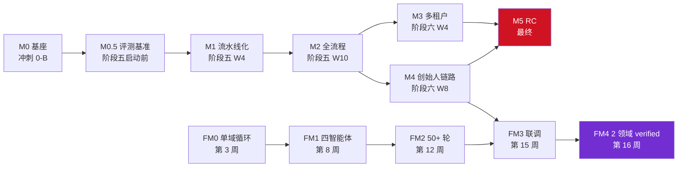

议题 1 由我牵头。这 4 项是阻塞级硬门禁，**今天必须把方案敲定**。我按"怎么改、谁来改、什么时候改"三要素逐项给出预案，其他专家请针对性补充。

---

## 议题 1 · 整体策略

4 项里有 2 项（P-04 / P-05）正好落在我的分工范围（第十章 + 第十一章），另外 2 项（P-01 / P-02）属于第十二章。我会给出完整方案，但 P-04 / P-05 我会深入到字段级和架构图，P-01 / P-02 我给出标准化的模板骨架。

**建议时间分配**（35 分钟）：
- P-05 OTel：8 分钟（架构复杂，需要充分讨论）
- P-04 黄金集：10 分钟（内容最多，要确认 50 条草案）
- P-01 M5 硬门禁：8 分钟（要敲定 7 项硬指标）
- P-02 依赖关系：7 分钟（Mermaid 图 + 延期决策）
- 总结 + 分工：2 分钟

---

## P-05：OTel 集成范围不清（我提的问题，10 分钟讨论）

### 怎么改

补 §10.3.4~§10.3.8 共 5 个小节，**一次性把 OTel 集成落地**：

**§10.3.4 集成范围矩阵**

| 组件           | 是否集成     | 集成方式                               | 采样率                             | 接入点                            |
| -------------- | ------------ | -------------------------------------- | ---------------------------------- | --------------------------------- |
| 后端 .NET 服务 | ✅ 必集成     | OpenTelemetry .NET SDK + OTLP exporter | **100%**（错误） / **10%**（正常） | `Startup.cs` `AddOpenTelemetry()` |
| 前端 Vue3      | ⚠️ 仅核心页面 | OpenTelemetry JS + Browser exporter    | **100%**（错误） / **1%**（正常）  | `main.ts` 注入                    |
| 熔炉 Python    | ✅ 必集成     | OpenTelemetry Python + OTLP exporter   | 100%                               | 熔炉独立仓库                      |
| 沙箱 Docker    | ❌ 不集成     | —                                      | —                                  | 沙箱内部由沙箱自身可观测性负责    |

**§10.3.5 OTel Collector 部署架构**

```
[后端 .NET ×N] ─┐
[前端 Vue3 ×N]  ─┼─OTLP── [OTel Collector ×2 HA] ──┬── [Jaeger]
[熔炉 Python ×N]─┘                                   ├── [Loki]
                                                    └── [Tempo]
[Grafana] ←── [Prometheus] ←── [OTel Collector Metrics]
```

- **Collector 部署**：单实例启动，M2 前升级为 HA（2 实例 + LB）
- **存储后端**：Jaeger（trace）+ Loki（日志）+ Tempo（待评估）
- **保留期**：trace 7d / 日志 30d / metrics 90d
- **采样策略**：默认 10%，4xx/5xx 错误 100%

**§10.3.6 追踪 ID 传递规范**

- HTTP 调用：自动注入 W3C `traceparent` 头（OTel SDK 默认行为）
- Hangfire 任务：入队时把 traceparent 存到 `Job.Parameters`，启动时恢复
- LLM 网关：`BASE_AI_CALL_LOG` 新增 `F_TRACE_ID NVARCHAR(50)` 字段记录
- SignalR 推送：消息 payload 包含 `traceId`，前端报错时一键复制

**§10.3.7 性能开销预算**

OTel 集成后，业务性能指标**允许 5% 衰减**：
- §10.1.1 的 12 项指标重测（实测时已包含 OTel 开销）
- 100% 采样仅用于错误，正常请求 10% 采样

**§10.3.8 就绪判定标准（M0/M1/M2/M3 各阶段）**

| 阶段  | 就绪标准                                                     |
| ----- | ------------------------------------------------------------ |
| M0 前 | SDK 引入 + OTLP exporter 配置 + 1 个示例 trace 在 Jaeger 可见 |
| M1 前 | 跨服务 trace 完整（含 Hangfire + SignalR）                   |
| M2 前 | 生产 OTel Collector HA 部署 + Grafana dashboard 4 个（API/AI/沙箱/DB） |
| M3 前 | 跨租户 trace 隔离（按 `tenantId` 分索引）                    |

### 谁来改
- **首席架构师**：§10.3.5 部署架构图 + §10.3.8 就绪标准
- **后端工程师**：.NET SDK 集成 + Hangfire trace 传递 + `BASE_AI_CALL_LOG.F_TRACE_ID`
- **前端工程师**：Vue3 SDK 集成 + 核心页面埋点
- **运维工程师**：OTel Collector + Jaeger + Loki + Grafana 部署
- **熔炉工程师**：Python SDK 集成（独立仓库）

### 什么时候改
- **P0，今天定**：§10.3.4 集成范围矩阵（这是最大争议点）
- **本周内出**：§10.3.5 部署架构图 + §10.3.7 性能开销
- **M0 前**：.NET SDK 引入 + OTLP 配置（M0 是冲刺 0-B 已完成，但要确认 OTel 部分）
- **M1 前**：跨服务 trace 完整
- **M2 前**：生产部署 + Grafana

---

## P-04：50 条黄金集具体需求缺失（我提的问题，10 分钟讨论）

### 怎么改

补 §11.3.2.1 完整 50 条清单 + §11.3.6~§11.3.10 共 5 个落地小节。

**§11.3.2.1 50 条黄金集草案**（按 5 领域分组，每领域 10 条）

| 领域 | 难度 | 数量 | 草案需求（部分）                                           |
| ---- | ---- | ---- | ---------------------------------------------------------- |
| 教育 | 1-3  | 4    | 001 学生成绩管理、002 选课系统、003 在线考试、004 图书借阅 |
| 教育 | 4-7  | 4    | 005 综合教务、006 校园 OA、007 在线答疑、008 实验室预约    |
| 教育 | 8-10 | 2    | 009 智慧课堂（含工作流）、010 毕业论文管理（含审批流）     |
| 医疗 | 1-3  | 4    | 001 挂号系统、002 病历查询、003 药品库存、004 医生排班     |
| 医疗 | 4-7  | 4    | 005 电子病历、006 处方管理、007 检验报告、008 医保结算     |
| 医疗 | 8-10 | 2    | 009 手术预约（含工作流）、010 远程会诊（含多角色）         |
| 制造 | 1-3  | 4    | 001 MES 生产排程、002 设备维护、003 质量检测、004 仓储管理 |
| 制造 | 4-7  | 4    | 005 BOM 管理、006 工艺路线、007 工时管理、008 委外加工     |
| 制造 | 8-10 | 2    | 009 智能车间（含大屏）、010 供应链协同（含工作流）         |
| 零售 | 1-3  | 4    | 001 进销存、002 会员管理、003 收银系统、004 库存查询       |
| 零售 | 4-7  | 4    | 005 营销活动、006 分销管理、007 门店调拨、008 促销规则     |
| 零售 | 8-10 | 2    | 009 全渠道中台（含大屏）、010 智能选品（含规则引擎）       |
| 通用 | 1-3  | 4    | 001 待办事项、002 文件管理、003 数据看板、004 通讯录       |
| 通用 | 4-7  | 4    | 005 项目管理、006 工单系统、007 CRM 基础、008 审批流       |
| 通用 | 8-10 | 2    | 009 综合 ERP（含工作流+大屏）、010 BI 平台（含规则引擎）   |

**§11.3.6 黄金集构建 SOP**

1. 创始人 + AI 工程师每月 5-10 条新需求（每周评审）
2. 每个需求由 2 个 SubAgent 独立生成 IR，取共识
3. AI 工程师 review + 标注 expectedIR
4. 创始人最终审批入库
5. 黄金集版本化（F_VERSION）

**§11.3.7 评分算法**

- IR Schema 层（30%）：JSON Schema 校验（必过）
- 业务语义层（50%）：关键节点匹配 ≥ 80%
- 视觉/交互层（20%）：LLM-as-Judge + 人工抽检
- 总分 ≥ 80% 算通过

**§11.3.8 基线管理**

`EVAL_GOLDEN_SET` 表新增 5 字段：
- `F_BASELINE_MODEL NVARCHAR(50)` - 基线模型
- `F_BASELINE_SCORE DECIMAL(5,2)` - 基线分数
- `F_VERSION INT DEFAULT 1` - 黄金集版本
- `F_TAGS NVARCHAR(200)` - 标签
- `F_REQUIREMENT_TYPE NVARCHAR(20)` - CRUD/流程/大屏/移动端

**§11.3.9 评测执行规范**

- PR merge 前必跑（阻塞）
- 每天 02:00 全量跑（日报）
- 每周一生成趋势报告（周报）
- 评测结果展示页面：EvalReport.vue（待建）

**§11.3.10 评测失败处理**

- 单条失败：记录 `EVAL_RUN_LOG`，不阻塞 PR
- 同一条连续 3 次失败：自动 GitHub Issue + 通知 AI 工程师
- 整体通过率 < 80%：自动回滚到上一个通过的版本

### 谁来改
- **创始人**：最终审批 + 需求来源
- **AI 工程师**：IR 设计与 review + 评测运行器
- **测试工程师**：自动化 + CI 集成
- **文档工程师**：50 条需求文档化
- **数据库工程师**：`EVAL_GOLDEN_SET` 表 ALTER

### 什么时候改
- **P0，本周内**：50 条草案 + DDL 字段补丁 + SOP
- **下周评审**：50 条定稿 + 评分算法
- **M0.5 完成**（阶段五启动前）：黄金集 ≥ 50 + 评测运行器
- **M5 前**：自动回滚机制

---

## P-01：M5 发布候选缺少硬门禁

### 怎么改

把 §12.1 M5 行的 "Gate + 集成 + Demo" 分解为 **7 项硬门禁 + 每项的验收标准 + 自动化方式**：

| #    | 硬门禁                 | 验收标准                                            | 自动化方式       | 阻塞性 |
| ---- | ---------------------- | --------------------------------------------------- | ---------------- | ------ |
| H1   | **集成测试 100% 通过** | §11.2.1 10 条 + 议题 4 锁定 18 端点对应测试全绿     | CI 自动运行      | 阻塞   |
| H2   | **黄金集通过率 ≥ 80%** | 50 条至少 40 条通过评分算法                         | CI 自动评分      | 阻塞   |
| H3   | **越权测试 10 条全绿** | §9.3.2 全绿 + §9.5 L3 不可越权 5 条新增             | CI 自动运行      | 阻塞   |
| H4   | **E2E Demo 现场通过**  | 3 个真实场景（OA 进销存/教育选课/医疗挂号）现场演示 | 人工验收         | 阻塞   |
| H5   | **CI Gate 全绿**       | 所有 PR 必须通过 CI 才能 merge                      | GitHub Actions   | 阻塞   |
| H6   | **性能基线达标**       | §10.1.1 的 12 项指标全部实测达标                    | vitest benchmark | 阻塞   |
| H7   | **安全审计通过**       | 创始人 L3 不可越权清单 + TOTP + 审计表完整性        | 自动 + 人工      | 阻塞   |

**§12.1 改造示例**：

```diff
- **M5 发布候选** | 最终 | Gate + 集成 + Demo | `v5.2-studio-rc1` | ⚠️ 待验证
+ **M5 发布候选** | 最终 | 7 项硬门禁全绿 + RC1 tag | `v5.2-studio-rc1` | ⚠️ 待验证
+   - H1 集成测试 100% 通过（10 条 + 18 端点）
+   - H2 黄金集通过率 ≥ 80%（50 条 ≥ 40 条）
+   - H3 越权测试 10 条全绿 + L3 不可越权 5 条
+   - H4 E2E Demo 现场通过（3 场景）
+   - H5 CI Gate 全绿（PR 必须通过）
+   - H6 性能基线达标（12 项指标实测）
+   - H7 安全审计通过（L3 + TOTP + 审计表）
```

### 谁来改
- **首席架构师**：M5 硬门禁定义 + 与 §12.1 其他里程碑对齐
- **测试工程师**：H1/H2/H3/H5 自动化
- **运维工程师**：H5 CI 配置
- **AI 工程师**：H2 黄金集评测
- **创始人**：H4 现场 Demo 验收

### 什么时候改
- **P0，今天定**：7 项硬门禁清单 + 验收标准
- **本周内出**：每项的自动化脚本骨架
- **M5 前 2 周**：所有门禁接入 CI
- **M5 当天**：7 项全部 ✅ 才能打 RC1 tag

---

## P-02：里程碑依赖关系未明确

### 怎么改

补 §12.9 跨里程碑依赖图 + §12.10 延期决策矩阵：

**§12.9 依赖图（Mermaid）**



**关键路径（CPM）**：

- **关键路径 1**（Studio）：M0 → M0.5 → M1 → M2 → M3 → M5（冲刺 0-B + 18 周 ≈ 19 周）
- **关键路径 2**（Studio）：M0 → M0.5 → M1 → M2 → M4 → M5（冲刺 0-B + 18 周 ≈ 19 周）
- **关键路径 3**（Foundry）：FM0 → FM1 → FM2 → FM3 → FM4（16 周）
- **汇合点**：FM3（第 15 周）↔ M4（阶段六 W8）第 15 周

**§12.10 延期决策矩阵**

| 里程碑        | 优先级 | 可延期  | 延期影响               |
| ------------- | ------ | ------- | ---------------------- |
| M0 基座       | **P0** | 不可    | 阻塞所有下游           |
| M0.5 评测基准 | **P0** | 不可    | M1 缺少评测基线        |
| M1 流水线化   | P1     | 1 周    | M2 同步延期            |
| M2 全流程     | P1     | 1 周    | M3/M4 同步延期         |
| M3 多租户     | P2     | 2 周    | M5 延期（关键路径）    |
| M4 创始人链路 | P2     | 2 周    | M5 延期（关键路径）    |
| M5 RC         | **P0** | 不可    | 发布窗口锁定           |
| FM0~FM4       | P2     | 各 2 周 | 不影响 Studio 关键路径 |

### 谁来改
- **首席架构师**：§12.9 依赖图
- **项目经理**：§12.10 延期决策矩阵 + 与甘特图对齐
- **测试工程师**：CI 接入延期检查脚本

### 什么时候改
- **P0，今天定**：依赖图 + 延期决策矩阵
- **本周内出**：Mermaid 图渲染验证 + 与 §4.8 甘特图交叉检查
- **下周评审**：全员确认无异议

---

## 合并建议（议题 1 内部）

4 项里有 **2 个合并点**必须在会上确认：

1. **P-04 + P-05**：黄金集评测要用 OTel trace ID 关联（黄金集失败时能跳到对应 trace）
   - `EVAL_GOLDEN_SET` 加 `F_TRACE_ID_TEMPLATE` 字段（期望 trace 模式）
   - `EVAL_RUN_LOG` 加 `F_TRACE_ID` 字段（实际跑出来的 trace）
2. **P-01 + P-02**：H1/H2/H3 自动化测试的延期检测，要基于依赖图判断
   - 关键路径上的测试不能 skip
   - 非关键路径可以 skip 但要记录

---

## 跨议题一致性（议题 1 内部）

| 检查项                                  | 状态         |
| --------------------------------------- | ------------ |
| P-01 H2 黄金集 ← P-04 50 条清单         | ✅ 同步       |
| P-01 H6 性能 ← P-05 OTel（5% 开销预算） | ✅ 同步       |
| P-02 关键路径 ← §4.8 甘特图             | ⚠️ 需会上核对 |
| P-02 FM3 ↔ M4 联调 ← §12.5              | ✅ 同步       |

---

## 给其他专家的补充接口

| 议题                  | 邀请补充的专家                                               |
| --------------------- | ------------------------------------------------------------ |
| P-05 OTel 部署架构    | **千问**（基础设施）+ **运维**                               |
| P-04 黄金集 50 条草案 | **清言**（领域专业度，医疗/制造可能需要业务专家补充）+ **AI 工程师** |
| P-01 M5 硬门禁        | **测试工程师**（自动化可行性）+ **创始人**（H4 Demo 场景选择） |
| P-02 依赖关系         | **项目经理** + **首席架构师**                                |

---

请各位专家针对性补充。我建议按 P-05 → P-04 → P-01 → P-02 顺序过，**每项 8-10 分钟**，最后留 2 分钟确认分工和截止时间。

有反对或补充直接说，会上一并定。