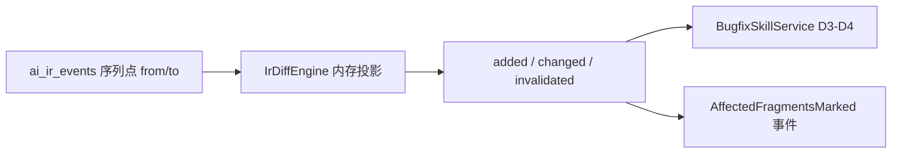

# 阶段五 Day1 施工包 — P5-B01 IrDiffEngine

> **状态：** 待架构师审核（Day1 编码已启动）  
> **锚点文档：** [`13、全链条第五阶段开发计划.md`](../AI原生开发/1、多用户多任务并行/13、全链条第五阶段开发计划.md) §4.1  
> **前置：** 阶段四 D16 ✅（`phase4-dod-verify.mjs` 9/9 含 D11）

---

## 1. 背景与目标

### 当前状态

- 阶段四主链已交付：`developer-skill` → sandbox → arch-guard → promote → `tester-skill`
- Bug 修复尚无增量重算能力；`BugfixSkillService` 依赖「两序列点 IR 快照 diff」

### 期望状态（Day1–Day2）

- `IrDiffEngine.CompareAsync(projectId, tenantId, fromSequence, toSequence)` 可产出 `IrDiffResult`
- PhaseB 覆盖：空 diff、promote 变更、EventSpec 下游传播、locked 保护、100 事件性能
- 为 D3–D4 `BugfixSkillService` 提供 `AffectedFragmentsMarked` 输入



---

## 2. 影响范围

| 模块 | 文件 | 动作 |
|------|------|------|
| IR 核心 | `Ir/IrDiffEngine.cs` | **新增** CompareAsync |
| 依赖图 | `Ir/IrFragmentDependencyMap.cs` | **新增** 下游传播表 |
| DTO | `Entitys/Dto/Ir/IrDtos.cs` | **新增** IrDiffOptions / IrDiffResult |
| 测试 | `tests/JNPF.Tests.PhaseB/IrPhase5DiffTests.cs` | **新增** 5 用例 |
| 进度 | `docs/progress-registry.yaml` | 更新 current_phase |

**不涉及：** 前端、DDL 迁移、BugfixSkill API（Day3 起）

---

## 3. 分阶段任务

### 阶段 1：P5-B01 IrDiffEngine（Day1 — 本包）

- [x] 1.1 — `IrDiffOptions` / `IrDiffResult` DTO
- [x] 1.2 — `IrFragmentDependencyMap`（EventSpec → DDL/Codegen/TestSuite；不含 arch/ui D3 场景）
- [x] 1.3 — `IrDiffEngine`：内存 SQLite + `IrProjectionEngine` 双点投影
- [x] 1.4 — `IrPhase5DiffTests` 5 用例 + TestRunner 注册
- **验收标准：** `dotnet run` PhaseB 全绿；100 事件 diff < 500ms

### 阶段 2：BugfixSkill 接入（Day3–D4 — 下一包）

- [x] 2.1 — `IrEventTypes` 增补 `BugReported` / `AffectedFragmentsMarked` / `BugFixed`
- [x] 2.2 — `BugfixSkillService.ReasonAsync` 调用 `IIrDiffEngine`
- [x] 2.3 — `POST /api/studio/skills/bugfix/{pipelineId}/run`
- [x] 2.4 — `GET /api/studio/ir/{pipelineId}/diff?from=&to=`（Day2 附加）
- **验收标准：** 字段级 Bug 只 invalidate DDL + IR3；arch/ui 快照 hash 不变（文档 13 §6 D3）✅ PhaseB

### 阶段 3：DeploySkill（Day5–D6）

- [ ] 3.1 — `DeploySkillService` + `DeploymentVerified` 事件
- [ ] 3.2 — 部署验证脚本对接 `docker-compose.production.yml`
- **验收标准：** IR-3 stable + TestSuite pass → deploy 脚本 exit 0

---

## 4. 风险与对策

| 风险 | 概率 | 对策 |
|------|------|------|
| 内存 SQLite 投影与生产 SQL Server 行为漂移 | 中 | PhaseB 用真实事件链种子；Green path pipeline 220 补集成测（Day7） |
| locked 片段误 invalidate | 中 | 默认 `ForceUnlock=false`；导师审批 flag |
| diff 空集仍触发 rerun | 低 | BugfixSkill 边界：`IsEmpty` → 拒绝 append BugFixed（文档 13 §15 #2） |
| MSB4166 并行 build | 中 | sandbox / PhaseB 统一 `-m:1`（阶段四已加固） |

---

## 5. 验证计划

```powershell
# Day1 门禁
cd D:\JNPF-v52\backend\tests\JNPF.Tests.PhaseB
dotnet build -v q /nodeReuse:false -m:1 -p:RunAnalyzers=false
dotnet run --no-build

# 阶段四回归（开工前已跑）
node D:\JNPF-v52\scripts\phase4-dod-verify.mjs --skip-green --no-cleanup
# 期望：summary 9/9
```

---

## 本节核心表清单

- **ai_ir_events** — 序列点 diff 源数据
- **ai_ir_fragment_snapshots** — 投影对比目标

## 本节关键代码路径索引

| 类 | 方法 | 说明 |
|----|------|------|
| `IrDiffEngine` | `CompareAsync` | 主入口 |
| `IrFragmentDependencyMap` | `GetDownstreamFragmentTypes` | D3 传播边界 |
| `IrProjectionEngine` | `ProjectEventAsync` | 内存重放 |
| `EventSpecRevisionPlanner` | `GetAffectedSteps` | IR-1 SA 步骤（Bugfix 复用参考） |

---

**待架构师审核项：** `ForceUnlock` 默认 false 是否足够；FormPageIR 空传播表是否满足全部 D3 场景。
