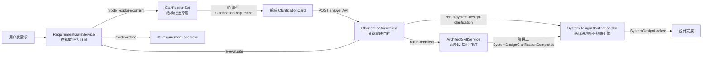

# studio-clarification

> **状态**：draft（P1+P2+P3 已实现，待运行时验证）
> **日期**：2026-07-06
> **适用版本**：JNPF v5.2
> **一句话描述**：需求分析 / 架构设计 / 总体设计三阶段的交互式澄清问答系统，LLM 产出结构化选择题让用户逐条细化需求，关键题硬门控推进流程，完整 IR 事件化可审计回放。

## 1. 架构概览



三阶段差异化实现，统一 IR 事件契约：

| 阶段 | 入口 | 提问 LLM | 暂停/恢复 | 答案注入 |
|------|------|---------|-----------|---------|
| 需求分析 | `AIDevelopmentPipelineService.StreamLlmResponseAsync` | `RequirementGateService.EvaluateMaturity` | sa-gate 对话流 `sse.Complete();return` | 对话历史 → 下一轮 maturity |
| 架构设计 | `ArchitectSkillService.ThinkAsync` | `GenerateArchitectureClarificationAsync`（BudgetGuard） | 两阶段 Skill 重跑 | answersText → ToT userPrompt |
| 总体设计 | `SystemDesignClarificationSkill.ThinkAsync` | `GenerateSystemDesignClarificationAsync`（BudgetGuard） | 两阶段 Skill 重跑 | answersText → SystemDesignLocked.assumptions |

## 2. 核心数据模型

### 2.1 IR 事件类型（`IrEventTypes.cs`）

| 事件常量 | 字符串值 | 触发 | fragment 状态 |
|---------|---------|------|--------------|
| `ClarificationRequested` | `"ClarificationRequested"` | LLM 生成提问 | `IR1_Clarification` → in-progress |
| `ClarificationAnswered` | `"ClarificationAnswered"` | 用户作答 | `IR1_Clarification` → stable |
| `SystemDesignClarificationCompleted` | `"SystemDesignClarificationCompleted"` | P3 阶段二留痕 | 不更新 fragment（null） |

### 2.2 ClarificationSet Schema（`ClarificationDtos.cs`）

```jsonc
{
  "setId": "uuid",
  "stage": "requirement|architecture|system-design",
  "round": 1,                    // 1-7
  "title": "请假时长计算规则",
  "intro": "以下问题影响数据库与状态机设计",
  "questions": [
    {
      "id": "q1",
      "text": "请假时长的计算单位？",
      "type": "single|multi|text",
      "required": true,           // 关键题硬门控
      "options": [
        { "id": "o1", "label": "自然日" },
        { "id": "o_other", "label": "其他", "freeText": true }  // 末项恒为其他
      ]
    }
  ],
  "allowSkipNonCritical": true
}
```

**不变量**（`RequirementGateService.BuildClarificationSet` / `ArchitectSkillService.BuildArchitectureClarificationSet` 强制）：
- `questions` 数量 ≤5
- 每个 `question.options` 数量 ∈ [3,5]
- 每个 `question.options` 末项必须 `{id:"o_other",label:"其他",freeText:true}`
- `type ∈ {single, multi, text}`
- `required=true` 的题 ≤2 个/轮
- `round ∈ [1,7]`（`Clarification:MaxRounds` 默认 7）

### 2.3 fragmentId 按 stage 区分

| stage | fragmentId 模式 | 示例 |
|-------|----------------|------|
| requirement | `clarification:requirement:{projectId}` | `clarification:requirement:abc123` |
| architecture | `clarification:architecture:{projectId}` | `clarification:architecture:abc123` |
| system-design | `clarification:system-design:{projectId}` | `clarification:system-design:abc123` |

同 `IrFragmentTypes.Clarification`（`"IR1_Clarification"`）类型靠 fragmentId 前缀区分，避免三阶段 fragment 混淆。

## 3. 三阶段实现

### 3.1 需求分析阶段

**入口**：`AIDevelopmentPipelineService.StreamLlmResponseAsync`（第 1028-1090 行 else 分支）

```
EvaluateMaturity(LLM) → mode ∈ {explore, confirm}
  → BuildClarificationSet(maturity, round)
  → _irEventStore.AppendAsync(ClarificationRequested)
  → sse.TrySend("clarification_requested", setJson)
  → sse.Complete(); return  // 暂停流式 LLM
```

**轮次管理**：`assistantMsgCount` 计数 + `Clarification:MaxRounds`（默认 7），触顶强制 refine。

**作答闭环**：`POST /api/studio/skills/clarification/{id}/answer` → 关键题硬门控 → 写 ClarificationAnswered + 答案存对话历史 → 返回 `nextAction=re-evaluate` → 前端重新触发 sa-gate → 下一轮 maturity 评估。

### 3.2 架构设计阶段（两阶段 Skill）

**关键约束**：`ThinkAsync` 是 `IAsyncEnumerable<AppendIrEventRequest>`，单次消费，return 即 run 结束。故采用两阶段：

```
阶段一：ThinkAsync 检查 snapshot.Find(Clarification, Stable) == null
  → GenerateArchitectureClarificationAsync(BudgetGuard LLM)
  → _sseHub.TryPush("clarification_requested", setJson)
  → yield ClarificationRequested → yield break（暂停）
  ↓ ValidateOutputAsync 放行（允许 1 条 ClarificationRequested）
  ↓ 用户作答 → ClarificationAnswered → fragment stable
阶段二：重跑 architect-skill → ThinkAsync 检查 stable Clarification
  → 读 answersText → 注入 GenerateArchitectureViaTotAsync 的 userPrompt
  → ToT N=3 → ArchitectureDecisionRecorded
```

**ValidateOutputAsync 放宽**（`ArchitectSkillService.cs:88-99`）：允许 1 条 `ArchitectureDecisionRecorded` **或** 1 条 `ClarificationRequested`。

### 3.3 总体设计阶段（自包含两阶段 Skill）

`SystemDesignSkillService`（纯约束引擎）**不动**。新建 `SystemDesignClarificationSkill`（`DesignSkillIds.SystemDesignClarification`）：

```
阶段一：同架构阶段（调 LLM 生成总体设计澄清题）
阶段二：读 answersText
  → yield SystemDesignClarificationCompleted（留痕）
  → _constraintEngine.Evaluate(snapshot)
  → critical 违规则 ConstraintViolationReported + 拒绝
  → 通过则 SystemDesignLocked（payload.assumptions = answersText 留痕）
```

**assumptions 留痕**：约束引擎不消费 LLM prompt，但用户作答写入 `SystemDesignLocked` payload 的 `assumptions` 字段，支持审计回放。

## 4. 关键代码路径

### 4.1 projection 补全（两阶段模式基石）

`IrProjectionEngine.ProjectEventAsync`（`IrProjectionEngine.cs:60-85`）原本不认识 Clarification 事件（落入 `_ => null`）。补 `UpsertClarificationAsync`：

```csharp
IrEventTypes.ClarificationRequested => await UpsertClarificationAsync(evt, IrStabilityStates.InProgress, ct),
IrEventTypes.ClarificationAnswered => await UpsertClarificationAsync(evt, IrStabilityStates.Stable, ct),
```

第二次 run 的 `BuildSnapshotAsync` 才能查到 stable 的 Clarification fragment。

### 4.2 关键题硬门控

`SkillsApiService.AnswerClarificationAsync`（`SkillsApiService.cs:288-300`）：

```csharp
foreach (var q in set.Questions.Where(x => x.Required))
{
    if (!answeredIds.Contains(q.Id))
        throw Oops.Bah($"关键问题「{q.Text}」必须作答才能继续");
}
```

### 4.3 SSE 推送（设计阶段）

SkillHarness 只推 `ir_event`/`skill_progress`，前端问卷卡需 `clarification_requested` 事件名。故在 Skill 内显式推：

```csharp
_sseHub.TryPush(context.PipelineId, "clarification_requested",
    JsonSerializer.Serialize(clarificationSet, JsonOptions));
```

### 4.4 前端 SSE 分支

`AiChatPanel.vue` `processSseEvent`（约第 806 行）：

```ts
case 'clarification_requested': {
  const clarificationData = parseSseJsonPayload(data.data);
  msg.clarification = clarificationData || data.clarification || null;
  break;
}
```

模板渲染 `<ClarificationCard>`，作答后 `onClarificationAnswered` 按 `nextAction` 分支（re-evaluate / rerun-architect / rerun-system-design-clarification）。

## 5. 编码约束

1. **每题末项恒为"其他"+ freeText** —— `BuildClarificationSet` / `BuildOptions` 强制，LLM 输出不规范时裁剪+补"其他"
2. **关键题 ≤2 个/轮** —— `requiredCount < 2` 守卫
3. **LLM 失败必降级** —— `BuildFallbackSet`（需求）/ `BuildFallbackArchitectureClarification`（架构）/ `BuildFallbackSystemDesignClarification`（总体）保证流程不卡死
4. **fragmentId 按 stage 区分** —— 避免三阶段 fragment 混淆
5. **逃生口始终可见** —— ClarificationCard 底部"全部跳过直接分析"按钮，对应 ForceRefine 语义

## 6. 配置

| 配置项 | 默认值 | 说明 |
|--------|--------|------|
| `Clarification:MaxRounds` | 7 | 需求分析阶段提问轮次上限，触顶强制 refine |

## 本节核心表清单

- §2.1 IR 事件类型表
- §2.2 ClarificationSet Schema
- §2.3 fragmentId 按 stage 区分表
- §3 三阶段实现对比表
- §6 配置表

## 本节关键代码路径索引

| 机制 | 文件 | 关键行 |
|------|------|--------|
| 需求提问决策 | `AIDevelopmentPipelineService.cs` | 1028-1090 |
| 提问构造 | `RequirementGateService.cs` BuildClarificationSet | 276+ |
| 架构两阶段 | `ArchitectSkillService.cs` ThinkAsync | 110-160 |
| 总体设计两阶段 | `SystemDesignClarificationSkill.cs` ThinkAsync | 110-180 |
| projection 补全 | `IrProjectionEngine.cs` UpsertClarificationAsync | 85+ |
| 关键题门控 | `SkillsApiService.cs` AnswerClarificationAsync | 288-300 |
| 前端 SSE 分支 | `AiChatPanel.vue` processSseEvent | 806 |
| 前端作答回调 | `AiChatPanel.vue` onClarificationAnswered | 1180 |
