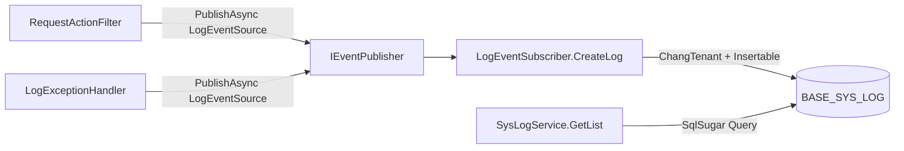

# logging-audit

> **状态**：draft（OpenSpec change `add-logging-audit-spec`，待 archive）  
> **日期**：2026-05-31  
> **适用版本**：JNPF V5.2  
> **一句话描述**：系统审计日志经 EventBus 异步写入 **BASE_SYS_LOG**，由 `SysLogService` 提供查询 API。

## 1. 架构概览



## 2. 核心表

| 表名 | 实体 | 关键字段 |
|------|------|----------|
| **BASE_SYS_LOG** | `SysLogEntity` | `F_Type`（1登录/2访问/3操作/4异常/5请求）、`F_USER_ID`、`F_REQUEST_URL`、`F_JSON`、`F_MODULE_NAME` |

实体路径：`backend/modularity/system/JNPF.Systems.Entitys/Entity/System/SysLogEntity.cs`

## 3. 日志类型与事件 ID

| Type | 含义 | EventId | 生产者 |
|------|------|---------|--------|
| 4 | 异常日志 | `Log:CreateExLog` | `LogExceptionHandler.OnExceptionAsync` |
| 5 | 请求日志 | `Log:CreateReLog` | `RequestActionFilter` |
| 3 | 操作日志 | `Log:CreateOpLog` | `RequestActionFilter` |
| 2 | 访问日志 | `Log:CreateVisLog` | 【待切面1验证】 |

## 4. 关键代码路径

### 4.1 异常日志投递

文件：`backend/modularity/common/JNPF.Common.Core/Filter/LogExceptionHandler.cs`  
方法：`OnExceptionAsync(ExceptionContext context)`  
行为：若 endpoint 无 `[IgnoreLog]`，构造 `SysLogEntity`（Type=4），经 `_eventPublisher.PublishAsync(new LogEventSource("Log:CreateExLog", tenantId, entity))` 投递。

```csharp
await _eventPublisher.PublishAsync(new LogEventSource("Log:CreateExLog", tenantId, new SysLogEntity
{
    Id = SnowflakeIdHelper.NextId(),
    Type = 4,
    RequestURL = httpRequest.Path,
    Json = context.Exception.Message + "\n" + context.Exception.StackTrace + ...
}));
```

### 4.2 EventBus 订阅写库

文件：`backend/modularity/common/JNPF.Common.Core/EventBus/LogEventSubscriber.cs`  
方法：`CreateLog(EventHandlerExecutingContext context)`  
装饰：`[EventSubscribe("Log:CreateReLog")]` 等 4 个事件  
行为：多租户时 `_tenantManager.ChangTenant`，再 `_sqlSugarClient.CopyNew().Insertable(log.Entity)`。

### 4.3 查询 API

文件：`backend/modularity/system/JNPF.Systems/System/SysLogService.cs`  
类：`SysLogService : IDynamicApiController`  
方法：`GetList([FromQuery] LogListQuery input)` — 按 `input.category`（Type）分页查询  
路由：`api/system/Log`（DynamicApi 自动生成）

### 4.4 Serilog 宿主集成

文件：`backend/framework/JNPF.Extras.Logging.Serilog/Extensions/SerilogHostingExtensions.cs`  
方法：`UseSerilogDefault(IHostBuilder builder, ...)` — 读取 `Serilog:WriteTo` 配置

## 5. 编码约束（切面1 前须遵守）

1. **禁止**在 Filter/Subscriber 中同步直写 **BASE_SYS_LOG**；须走 `IEventPublisher` + `LogEventSource`。
2. 只读/健康检查类 API 使用 `[IgnoreLog]`（`JNPF.Logging.Attributes.IgnoreLogAttribute`）。
3. 多租户日志须带 `tenantId` 并在 Subscriber 内 `ChangTenant`。
4. C# 符号改动前用 Serena `find_referencing_symbols` 查 `LogEventSubscriber`、`RequestActionFilter`。

## 6. 切面1 待决项

- [ ] TraceId 贯穿 Serilog + **BASE_SYS_LOG**
- [ ] `DatabaseLogger` / 文件 sink 与审计表职责边界
- [ ] 生产环境 Serilog 最低级别（见 `docs/conventions/logging.md`）

## 本节核心表清单

- **BASE_SYS_LOG** — 系统审计/操作/异常/请求日志

## 本节关键代码路径索引

| 路径 | 类/方法 |
|------|---------|
| `JNPF.Common.Core/Filter/LogExceptionHandler.cs` | `LogExceptionHandler.OnExceptionAsync` |
| `JNPF.Common.Core/Filter/RequestActionFilter.cs` | `RequestActionFilter`（请求/操作日志） |
| `JNPF.Common.Core/EventBus/LogEventSubscriber.cs` | `LogEventSubscriber.CreateLog` |
| `JNPF.Common.Core/EventBus/Sources/LogEventSource.cs` | `LogEventSource` |
| `JNPF.Systems/System/SysLogService.cs` | `SysLogService.GetList` |
| `JNPF.Systems.Entitys/.../SysLogEntity.cs` | `SysLogEntity` → **BASE_SYS_LOG** |
