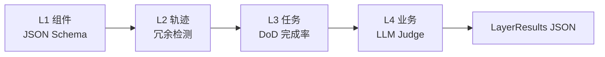
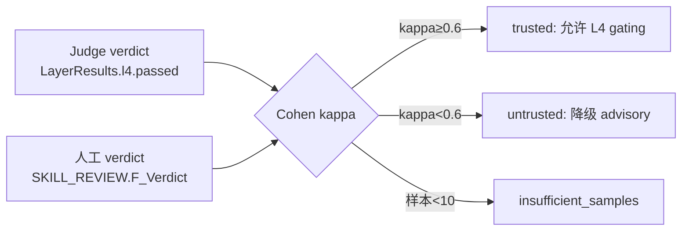

# Capability: studio-eval-pipeline

> **状态：** 已落地（2026-07-08，编译 + verify 23/23）  
> **文档：** [`docs/AI原生开发/1、多用户多任务并行/15、全链条第七阶段开发计划.md`](../../../docs/AI原生开发/1、多用户多任务并行/15、全链条第七阶段开发计划.md)

## 概述

Studio Skill 质量评估管线 — **2026-07-08 落地**（阶段七 P7-E01~E04 + P7-F01 + P7-Q01）：

1. **四层 Eval Pipeline** — L1 组件 / L2 轨迹 / L3 任务 / L4 业务，L1-L3 确定性（无 LLM），fail-fast 跳过 L4
2. **LLM-as-Judge** — L4 经 `SkillLlmBudgetGuard` fast tier 路由**跨家族 mimo**（生成走 deepseek），pass/fail 二元输出
3. **Judge 月度校准** — Cohen's kappa，<0.6 不可信（降级 advisory）
4. **人工抽检 + 质量榜 + 失败 trace 回收** — 生产 trace→eval 闭环

**核心原则：** 代码优先 + LLM 互补（L1-L3 确定性）；pass/fail 二元 > 1-5 分制；Judge 必须校准；不删 IR events。

## 用户路径（Q1–Q3）

| # | 问题 | 答案 |
|---|------|------|
| Q1 | 用户操作 | Skill 运行后触发 eval → 看质量榜 → 人工抽检 → 月度看 Judge 校准 |
| Q2 | 业务产物 | `BASE_AI_EVAL_RUN`（分层结果）+ `BASE_AI_SKILL_REVIEW`（人工评分）+ 质量榜 Tab |
| Q3 | E2E | `node scripts/phase7-eval-verify.mjs`（23 项 DoD 检查）|

## Eval Pipeline 四层



| 层 | 输入 | 输出 | LLM | 实现类.方法 |
|----|------|------|-----|------------|
| L1 组件 | IR 产出 fragment | pass/fail | 否 | `EvalPipelineRunner.RunLayer1ComponentAsync` |
| L2 轨迹 | ai_ir_events 序列（≤500） | 冗余调用检测 | 否 | `EvalPipelineRunner.RunLayer2TrajectoryAsync` |
| L3 任务 | skill_run 状态 + eventCount | 完成率 | 否 | `EvalPipelineRunner.RunLayer3TaskAsync` |
| L4 业务 | Judge pass/fail 二元 | PASS/FAIL | 是 fast | `LlmJudgeService.JudgeAsync` |

**fail-fast：** L1 不过直接返回，不跑 L2/L3/L4（六条生命线#2）

## 配置

| 键 | 文件 | 默认 |
|----|------|------|
| `eval-judge` policy | `ai_skill_llm_policy` 表 | maxCalls=1, fast, mimo |
| Judge `minSamples` | `JudgeCalibrationService` 常量 | 10 |
| `KappaTrustedThreshold` | `JudgeCalibrationService` 常量 | 0.6 |
| `IrEventPageSize` | `EvalPipelineRunner` 常量 | 500 |
| Judge `Temperature` | `LlmJudgeService` 常量 | 0.0 |

## 核心 API

| 方法 | 路径 | 类.方法 | Ticket |
|------|------|---------|--------|
| POST | `/api/studio/eval/execute` | `EvalService.ExecuteEval` | P7-E01 |
| GET | `/api/studio/eval/run/{runId}` | `EvalService.GetRun` | P7-E01 |
| GET | `/api/studio/eval/consistency/{caseId}` | `EvalService.GetConsistency` | P7-E01 |
| POST | `/api/studio/eval/judge` | `EvalService.JudgeEval` | P7-E02 |
| GET | `/api/studio/eval/calibration` | `EvalService.GetCalibration` | P7-E02 |
| POST | `/api/studio/skills/review` | `SkillReviewApiService.SubmitReview` | P7-E03 |
| GET | `/api/studio/skills/review/{skillRunId}` | `SkillReviewApiService.GetReviews` | P7-E03 |
| GET | `/api/studio/skills/quality-board` | `SkillQualityBoardService.GetBoard` | P7-E04 |
| POST | `/api/studio/skills/memory/collect-failures` | `SkillMemoryApiService.CollectFailures` | P7-E04 |
| GET | `/api/studio/skills/memory/ir-count` | `SkillMemoryApiService.GetIrCount` | P7-E04 |

## IR 事件

| 事件 | 含义 |
|------|------|
| `skill.review_recorded` | 人工抽检（由 `IExperienceRecorder.RecordReviewAsync` 写入，审计回放）|

> Eval 分层结果不写 IR 事件，持久化在 `BASE_AI_EVAL_RUN.F_LayerResults`（JSON）。

## 核心表

| 表 | 用途 | 迁移 |
|----|------|------|
| **BASE_AI_EVAL_RUN** | eval run + 分层结果 | `20260708_Phase7_Eval_Pipeline.sql`（加 10 列）|
| **BASE_AI_EVAL_CASE** | 金标准测试用例 | 既存 |
| **BASE_AI_EVAL_GOLDEN_SET** | 金标准集（含 auto_seed 失败回归集）| 既存 |
| **BASE_AI_SKILL_REVIEW** | 人工抽检评审（score/verdict/reviewer + 三元组）| `20260708_Phase7_Skill_Reviews.sql`（新表）|
| **ai_skill_runs** | Skill 运行审计（质量榜数据源）| 既存 |
| **ai_ir_events** | IR 事件（L2 轨迹数据源）| 既存 |
| **ai_skill_llm_policy** | LLM 策略（eval-judge 种子）| 加 eval-judge 行 |

## Judge 校准（Cohen's kappa）



Quartz Job `EvalCalibrationJob`（cron `0 0 2 1 * ?`，每月 1 日 02:00）遍历租户跑校准，写 `F_JudgeKappa` 基线。

## 验收命令

```powershell
# ① DoD 代码路径检查（23 项）
node scripts/phase7-eval-verify.mjs

# ② 后端编译验证
dotnet build modularity/inteAssistant/JNPF.InteAssistant/JNPF.InteAssistant.csproj

# ③ 前端 type-check（新文件）
pnpm type-check   # jnpf-web-vue3/
```

## 禁止项

- ❌ L1-L3 使用 LLM（仅 L4 Judge 允许）
- ❌ Judge 绕过 `SkillLlmBudgetGuard`（必须经 Guard fast tier）
- ❌ Judge 输出 1-5 分制（必须 pass/fail 二元）
- ❌ Judge 与生成同家族（必须跨家族 mimo vs deepseek，避免自偏好）
- ❌ 记忆遗忘删除 `ai_ir_events`（只裁剪 Prompt 上下文）
- ❌ Eval/review/质量榜查询不带 `TenantId`（R12 三元组隔离）

## 待办（后续验证，非阻塞）

- [ ] 执行 2 个迁移 SQL（需数据库可用）
- [ ] 启动后端跑 eval 端点冒烟（`jnpf-api.mjs`）
- [ ] 积累 ≥10 条人工抽检后产出首个 kappa 基线
- [ ] pass^k 从 k=1 提升到 k=3（按需）

## 本节关键代码路径索引

- `JNPF.InteAssistant/Studio/EvalPipelineRunner.cs`
- `JNPF.InteAssistant/Studio/EvalPipelineDtos.cs`
- `JNPF.InteAssistant/Studio/LlmJudgeService.cs`
- `JNPF.InteAssistant/Studio/JudgeCalibrationService.cs`
- `JNPF.InteAssistant/Studio/SkillReviewApiService.cs`
- `JNPF.InteAssistant/Studio/SkillQualityBoardService.cs`
- `JNPF.InteAssistant/Studio/MemoryRetentionService.cs`
- `JNPF.InteAssistant/Studio/EvalService.cs`
- `JNPF.InteAssistant/Job/EvalCalibrationJob.cs`
- `jnpf-web-vue3/src/views/studio/components/ir/IrSkillQualityTab.vue`
