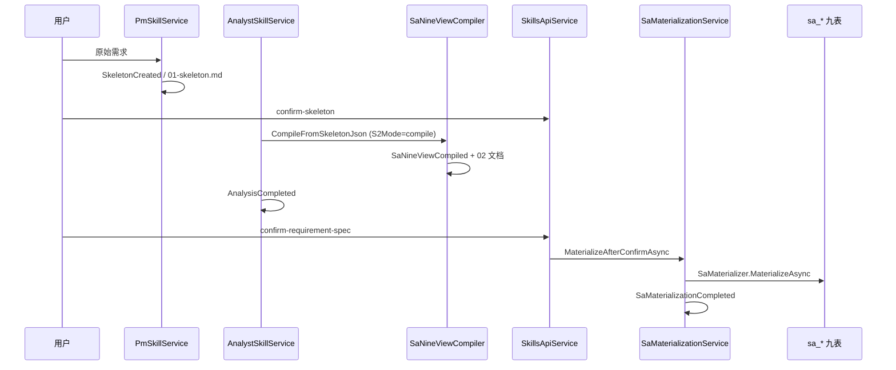

# Capability: studio-s2-compile

> **状态：** 已落地（2026-07-06，pipeline 311 验收）  
> **ADR：** [`ADR-004-s2-compile-csharp-materialize.md`](../../adr/ADR-004-s2-compile-csharp-materialize.md)

## 概述

Studio S0→S2 需求链经 **2026-07-06 架构重构**（ADR-004）：

1. **主链路径** — SA 九步 Agent 与生产主链分离；Analyst 默认走 **`SaNineViewCompiler`**（纯 C# 解析/投影），Skills 负责语义与双审。
2. **持久化** — **`sa_*` 九表物化从 sa-service 迁至 C#**；用户 `confirm-requirement-spec` 后由 **`SaMaterializer`** 直连主库。

**compile + confirm 物化不依赖 sa-service。** agent 模式仅用于 LLM 九步回归对比。

## 用户路径（Q1–Q3）

| # | 问题 | 答案 |
|---|------|------|
| Q1 | 用户操作 | 提交需求 → 门控 → 确认骨架 → 跑 Analyst → 读/批 `02` → 确认需求分析说明书 |
| Q2 | 业务产物 | `02-requirement-spec.md`；确认后 `sa_*` 九表可查 |
| Q3 | E2E | **`E2E_PIPELINE_ID=311 pnpm test:api`（首选）** · `phase-sup-s2-e2e.mjs verify`（evidence） |

## 主链路



## 配置

| 键 | 文件 | 默认 |
|----|------|------|
| `SaPipeline:S2Mode` | `Configurations/SaPipeline.json` | `"compile"` |

`agent` 仅用于 sa-service LLM 九步回归；**生产主链必须用 compile**。

## 核心 API

| 方法 | 路径 | 类.方法 |
|------|------|---------|
| POST | `/api/studio/skills/pm/{id}/run` | `PmSkillService` |
| POST | `/api/studio/skills/analyst/{id}/run` | `AnalystSkillService.ReasonAsync` |
| POST | `/api/studio/skills/pipeline/{id}/confirm-skeleton` | `SkillsApiService` |
| POST | `/api/studio/skills/pipeline/{id}/confirm-requirement-spec` | `SkillsApiService.ConfirmRequirementSpecAsync` |

## IR 事件（S2 关键）

| 事件 | 含义 |
|------|------|
| `SaNineViewCompiled` | Compiler 输出 bundle（物化输入） |
| `AnalysisCompleted` | S2 Skill 链完成 |
| `StageConfirmed` | 用户确认 S2 |
| `SaMaterializationCompleted` | 九表物化成功 |
| `SaMaterializationFailed` | 物化失败（可重试 confirm） |

## 核心表

| 表 | S2 compile 期间 | confirm 后 |
|----|-----------------|------------|
| **INTE_ASSISTANT_DELIVERABLE** | W（00–02） | R |
| **AI_IR_EVENT** | W | R |
| **sa_scope** … **sa_ui**（九表） | **不写** | W |

## 验收命令

```powershell
# ① 快断言（日常默认 ~10s）
E2E_PIPELINE_ID=311 pnpm test:api

# ② evidence / 长链（阶段交付按需）
node scripts/phase-sup-s2-e2e.mjs verify --pipeline-id 311

# 九表：sa-nine-tables-audit.sql @PipelineId = 311
```

## 禁止项

- ❌ compile 主链要求 sa-service :3001 常驻
- ❌ sa-service 写 JNPF 主库 `sa_*` 做物化
- ❌ S2 期间（confirm 前）写九表
- ❌ 仅用 `dotnet build` 声称 S2 完成

## 待办（非阻塞第 1 步收口）

- [ ] `phase-sup-s2-e2e.mjs materialize-wait` 纳入标准 E2E
- [ ] Vitest 增加 `SaMaterializationCompleted` 轮询 case

## 本节关键代码路径索引

- `JNPF.InteAssistant/Sa/SaPipelineOptions.cs`
- `JNPF.InteAssistant/Sa/SaNineViewCompiler.cs`
- `JNPF.InteAssistant/Sa/SaMaterializer.cs`
- `JNPF.InteAssistant/Sa/SaMaterializationService.cs`
- `JNPF.InteAssistant/Skills/AnalystSkillService.cs`
- `JNPF.InteAssistant/Skills/SkillsApiService.cs`
